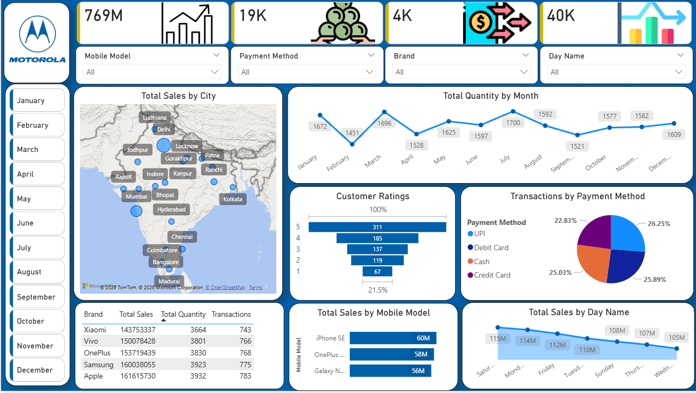

# 📱 Mobile Sales Data Dashboard – Power BI

## 📌 Project Overview

A Power BI dashboard that provides clear insights into mobile sales performance, customer trends, and brand comparisons.

## 📊 Dashboard Preview

## 📈 Key Metrics Tracked

| Metric | Description |
|--------|-------------|
| Total Sales | Overall revenue |
| Total Transactions | Number of orders |
| Average Sale Value | Revenue per transaction |
| Average Rating | Customer satisfaction score |
| Sales by City | Geographic performance |
| Sales by Month | Time trends |
| Payment Methods | UPI / Credit Card / Cash / etc. |
| Brand Performance | Apple, Samsung, Xiaomi, OnePlus, etc. |

## 🛠 Tools Used

- Power BI Desktop
- DAX (Custom measures)
- Power Query (Data cleaning)
- Data Modeling (Star Schema)

## 📁 Files

| File | Description |
|------|-------------|
| `Mobile Sales Dashboard.pbix` | Main Power BI file |
| `Dashboard.png` | Dashboard screenshot |

## 🚀 How to Open

1. Download `Mobile Sales Dashboard.pbix`
2. Open with Power BI Desktop (free)
3. Explore using slicers and click interactions

## 🙏 Acknowledgments

Thanks to **Satish Dhawale** (SkillCourse) for guidance and support.

## 📢 Connect

- **GitHub:** [RUDRAPRAKASHDAS](https://github.com/RUDRAPRAKASHDAS)

---

⭐ Star this repo if you find it useful!
